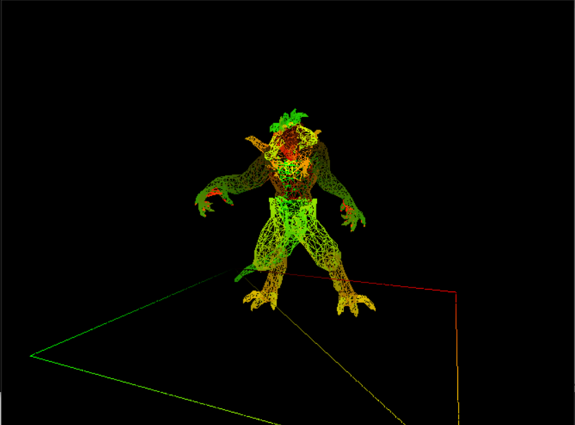
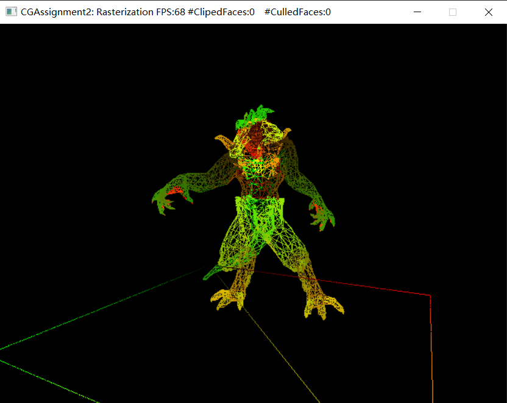
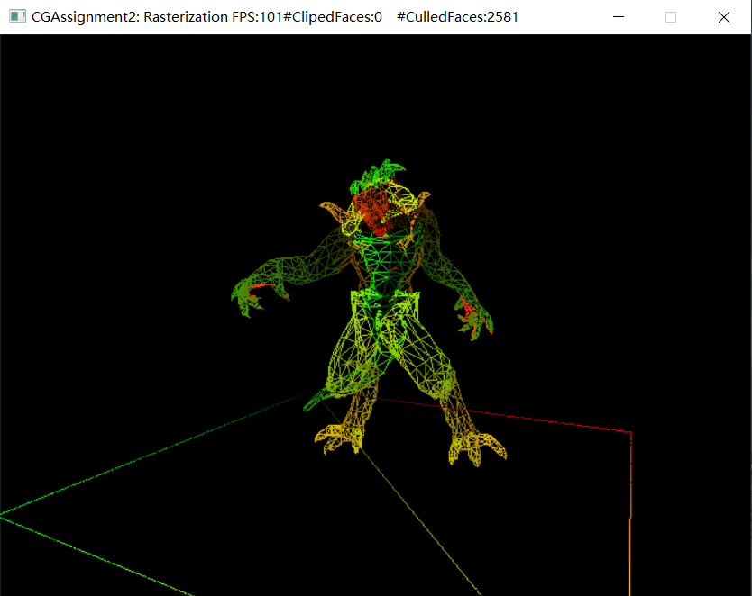
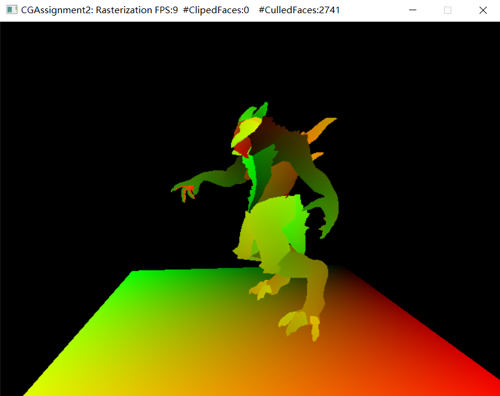
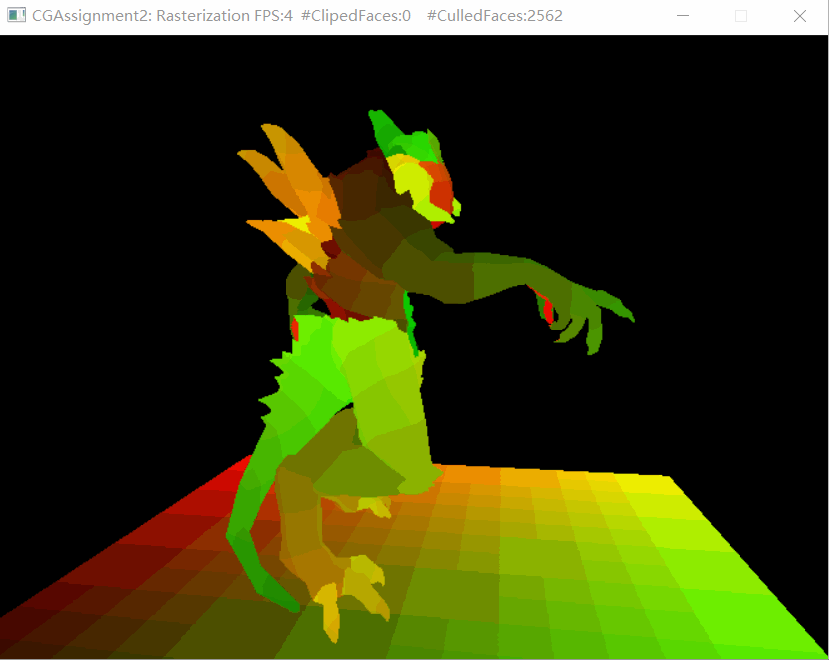

# SimpleSoftrRenderer_Rasterization
A tiny soft-renderer built from an existing  framework using C++ 11

## Bresenham


## Homogeneous Space Clipping
[reference](https://zhuanlan.zhihu.com/p/162190576)
```
std::vector<TRShaderPipeline::VertexData> TRRenderer::cliping(
		const TRShaderPipeline::VertexData &v0,
		const TRShaderPipeline::VertexData &v1,
		const TRShaderPipeline::VertexData &v2) const
{
    std::vector<TRShaderPipeline::VertexData> in_list, in_list1, in_list2, in_list3;
    clip_with_w({ v0,v1,v2 },in_list);//clip with w
    clip_with_plane(0, in_list, in_list1);//clip with w=x,w=-x
    clip_with_plane(1, in_list1, in_list2);//clip with w=y,w=-y
    clip_with_plane(2, in_list2, in_list3);//clip with w=z,w=-z
	return in_list3;
}
```

## Back Face Culling
left: without back face culling.                                                                           right: apply back face culling.

    

## Triangle  rasterization based on Edge-function with 4xMSAA


## Result


## Acknowledgement
The framework is derived from ZeusYang's [TinySoftRenderer](https://github.com/ZeusYang/TinySoftRenderer/tree/master).
